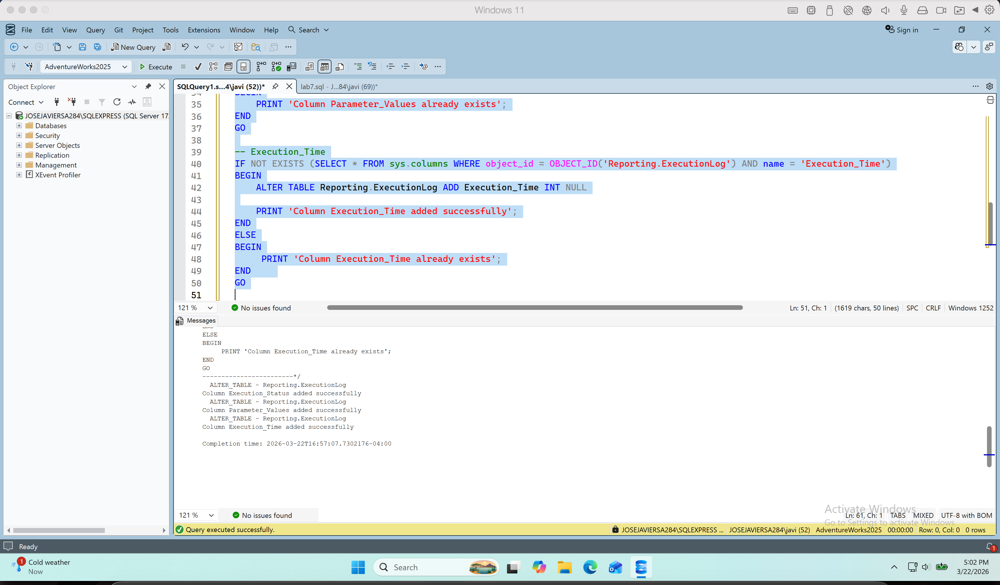
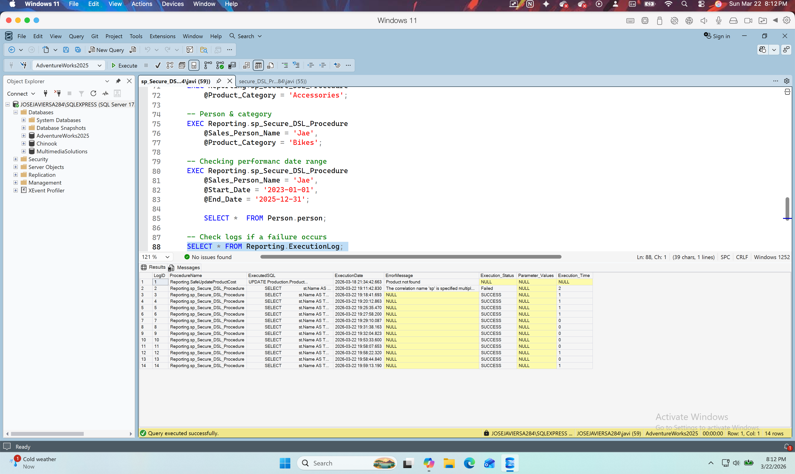

# Simulation 7: DSL logic execution and security

### Task 1 – Basic Execution Logging
In the first task I did the validation and creation of the table and the new filelds required:
ExecutionStatus (Success / Failed / Rejected)
ParameterValues (simple readable format)
ExecutionTime (optional)

I included messages to confirm the creation or their existenses and after performed the execution I got the expected result.



### Task 2 – Secure DSL Procedure

I create a DSL Procedure that allow me to generate different reports based on the paramenters given, 
 * Parameters required:
    -  @TerritoryName
    - @SalesPersonName
    - @ProductCategory
    - @StartDate
    - @EndDate
 * I validate the procedure executing:
```sql
-- Using only territory
EXEC Reporting.sp_Secure_DSL_Procedure 
    @Territory_Name = 'Northwest'

-- Using territory and ccategory
EXEC Reporting.sp_Secure_DSL_Procedure 
    @Territory_Name = 'Northwest', 
    @Product_Category = 'Bikes';
    
-- Catergory onluy
EXEC Reporting.sp_Secure_DSL_Procedure 
    @Product_Category = 'Accessories';

-- Person & category
EXEC Reporting.sp_Secure_DSL_Procedure 
    @Sales_Person_Name = 'Jae', 
    @Product_Category = 'Bikes'

-- Checking performanc date range
EXEC Reporting.sp_Secure_DSL_Procedure 
    @Sales_Person_Name = 'Jae',
    @Start_Date = '2023-01-01',
    @End_Date = '2025-12-31';

```

After each execution, a new record was added to the logs and I validate it with:
```sql
SELECT * FROM Reporting.ExecutionLog;
```

